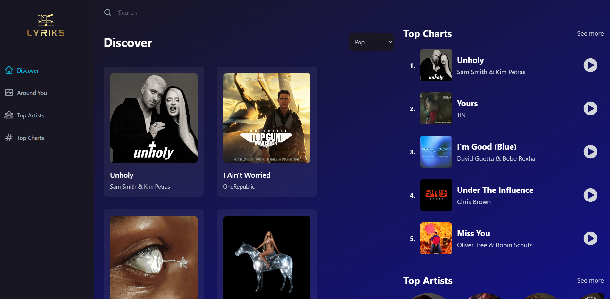

<h1>React Learning App - Movieland 
</h1>

## 1. Preview

This is my React Learning App which I learning from this youtuber channel:

- [https://www.youtube.com/watch?v=I1cpb0tYV74](https://www.youtube.com/watch?v=I1cpb0tYV74)



> demo page: [https://mr-addict.github/lyriks](https://mr-addict.github.io/lyriks)

## 2. Commands

### start

```bash
npm run dev
```

### build

```bash
npm run build 
```
